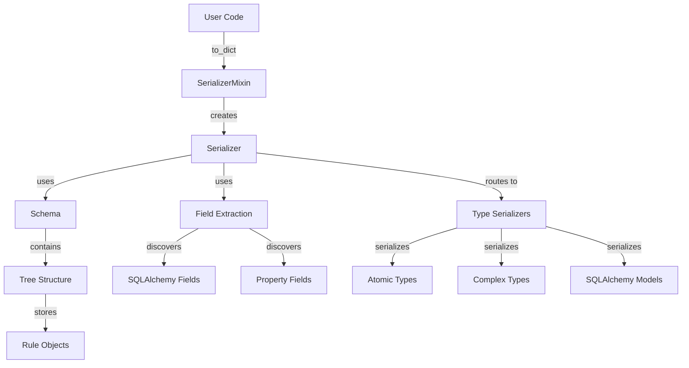
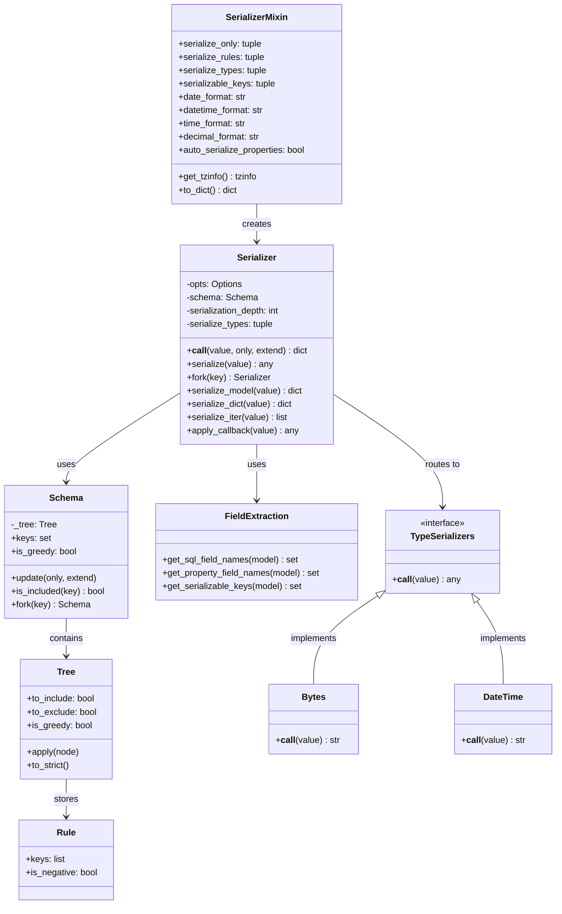
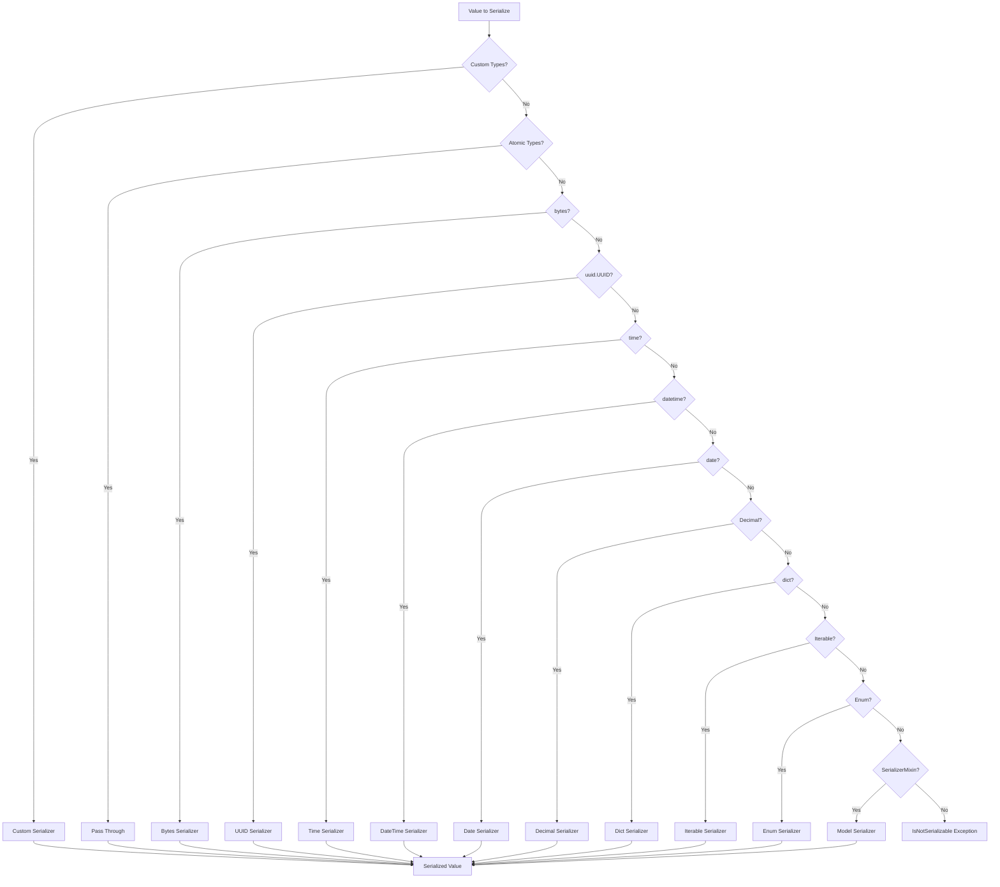
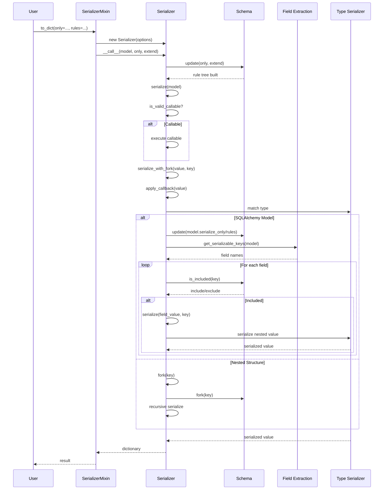
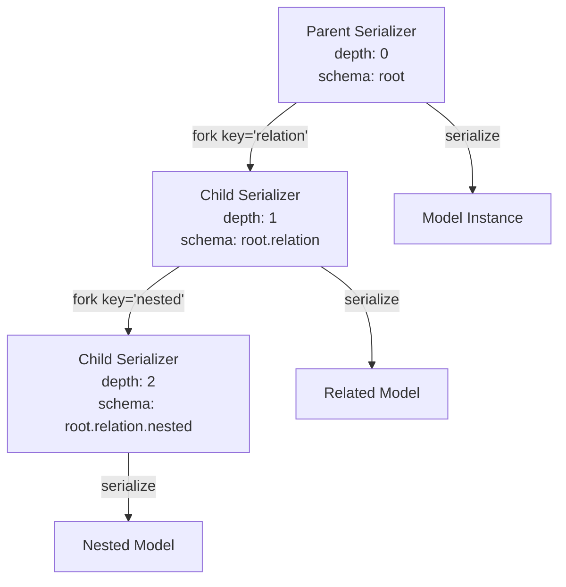

# Architecture Documentation

## System Architecture

SQLAlchemy-serializer is a lightweight serialization library that provides a mixin pattern for SQLAlchemy models. The library follows a **callback chain pattern** for type serialization and uses a **tree-based schema system** for field inclusion/exclusion rules.

### Architecture Overview



### Core Principles

- **Simplicity over complexity**: Minimal API surface, intuitive defaults
- **Composability**: Mixin pattern allows easy integration with existing models
- **Extensibility**: Custom type serializers and format overrides
- **Performance**: Efficient field introspection with caching, minimal overhead

## Component Overview

### Component Relationships



### 1. SerializerMixin (`serializer.py`)

The main entry point for users. A mixin class that adds `to_dict()` method to SQLAlchemy models.

**Responsibilities:**
- Provides model-level configuration (formats, rules, serializable keys)
- Creates `Serializer` instances with appropriate options
- Defines callback for timezone handling (`get_tzinfo()`)

**Key Attributes:**
- `serialize_only`: Exclusive field schema (makes serializer strict/non-greedy)
- `serialize_rules`: Field inclusion/exclusion rules (extends default schema)
- `serialize_types`: Custom type serializers as `(Type, callable)` tuples
- `serializable_keys`: Explicit list of fields to serialize (overrides introspection)
- Format attributes: `date_format`, `datetime_format`, `time_format`, `decimal_format`
- `auto_serialize_properties`: Boolean to automatically include `@property` fields

### 2. Serializer (`serializer.py`)

The core serialization engine that orchestrates the conversion process.

**Responsibilities:**
- Maintains serialization state (depth, options, schema)
- Routes values to appropriate type serializers via callback chain
- Handles nested structures through forking mechanism
- Manages callable detection and execution

**Key Methods:**
- `__call__()`: Entry point, updates schema and starts serialization
- `serialize()`: Orchestrates serialization, handles callables
- `apply_callback()`: Matches value type to serializer callback
- `fork()`: Creates new Serializer instance for nested structures
- `serialize_model()`: Handles SQLAlchemy model instances
- `serialize_dict()`: Handles dictionary structures
- `serialize_iter()`: Handles iterable collections

**Type Serialization Chain:**
The `serialize_types` tuple is checked in order (first match wins):



**Order of checks:**
1. Custom types (from `serialize_types` option)
2. Atomic types (int, str, float, bool, None) - pass through
3. bytes → `Bytes()`
4. uuid.UUID → `UUID()`
5. time → `Time()` (checked before datetime)
6. datetime → `DateTime()`
7. date → `Date()`
8. Decimal → `Decimal()`
9. dict → `serialize_dict()` (checked before Iterable)
10. Iterable → `serialize_iter()`
11. Enum → `Enum()`
12. SerializerMixin → `serialize_model()`

### 3. Schema System (`lib/schema.py`)

Tree-based rule engine for field inclusion/exclusion.

**Components:**

#### Tree
A recursive defaultdict structure that represents nested field rules.

**Properties:**
- `to_include`: Boolean flag for positive rules
- `to_exclude`: Boolean flag for negative rules
- `is_greedy`: Whether to include all fields by default (greedy mode) or only specified (strict mode)

**Behavior:**
- Greedy mode (default): Include all fields unless explicitly excluded
- Strict mode (`serialize_only`): Include only fields specified in rules
- Tree merging: Rules are merged recursively, with strictness propagating to subtrees

#### Rule
Parses rule strings into structured format.

**Syntax:**
- Positive: `'field'`, `'relation.field'`, `'relation.nested.field'`
- Negative: `'-field'`, `'-relation.field'`
- Delimiter: `.` separates nested levels
- Negation prefix: `-` indicates exclusion

#### Schema
Public API for rule management.

**Methods:**
- `update(only=(), extend=())`: Updates schema with new rules
  - `only`: Sets strict mode, replaces existing schema
  - `extend`: Adds rules in greedy mode
- `is_included(key)`: Checks if a field should be included
- `fork(key)`: Creates new Schema for nested structure
- `keys`: Returns set of top-level keys marked for inclusion

### 4. Field Extraction (`lib/fields.py`)

Utilities for discovering serializable fields on models.

**Functions:**
- `get_sql_field_names(model)`: Uses SQLAlchemy inspection to get mapper attributes
- `get_property_field_names(model)`: Uses Python `inspect` to find `@property` decorators
- `get_serializable_keys(model)`: Main function with `@functools.lru_cache` for performance
  - Returns `serializable_keys` if set on model
  - Otherwise combines SQL fields + properties (if `auto_serialize_properties=True`)

### 5. Type Serializers (`lib/serializable/`)

Pluggable serializers for specific Python types. All inherit from `Base` and implement `__call__()`.

**Available Serializers:**
- `Bytes`: Base64 encoding
- `UUID`: String representation
- `Time`: Time formatting with `strftime`
- `DateTime`: Datetime formatting with timezone support
- `Date`: Date formatting with `strftime`
- `Decimal`: Python `format()` string formatting
- `Enum`: Returns `value` attribute

**Pattern:**
```python
class CustomType(Base):
    def __init__(self, str_format=None, tzinfo=None):
        # Store configuration
        pass
    
    def __call__(self, value):
        # Return serialized representation
        return str(value)
```

## Data Flow

### Serialization Flow




## Design Decisions

### 1. Mixin Pattern
**Decision**: Use mixin instead of base class or decorator
**Rationale**: 
- Allows models to inherit from existing base classes
- Minimal intrusion on model definition
- Easy to add/remove serialization capability

### 2. Callback Chain for Type Serialization
**Decision**: Ordered tuple of (Type, callable) pairs checked sequentially
**Rationale**:
- Simple, explicit ordering
- Easy to override default behavior
- Supports multiple inheritance (tuple of types)
- First match wins (efficient)

### 3. Fork Pattern for Nested Structures
**Decision**: Create new Serializer instances for nested dicts/iterables/models
**Rationale**:
- Isolation: nested rules don't affect parent context
- Depth tracking: prevents infinite recursion
- Schema forking: nested rules work independently




### 4. Tree-Based Schema
**Decision**: Use recursive defaultdict structure for rules
**Rationale**:
- Efficient nested rule matching
- Supports dot-notation paths (`relation.field`)
- Greedy/strict mode propagation
- Easy to merge rules from multiple sources

### 5. Greedy vs Strict Modes
**Decision**: Two modes - greedy (include all) vs strict (include only)
**Rationale**:
- Greedy: Convenient default, minimal configuration
- Strict: Explicit control, security (don't leak fields)
- `serialize_only` switches to strict mode

### 6. Swallowing Exceptions in Iterables
**Decision**: Catch `IsNotSerializable` in `serialize_iter()` and continue
**Rationale**:
- Allows partial serialization of mixed-type collections
- Prevents one bad item from breaking entire serialization
- **Known Issue**: May hide legitimate errors (see FIXME in code)

### 7. LRU Cache for Field Introspection
**Decision**: Cache `get_serializable_keys()` results
**Rationale**:
- SQLAlchemy inspection is relatively expensive
- Field names don't change at runtime
- Significant performance improvement for repeated serialization

### 8. Options Pattern
**Decision**: Use `namedtuple` for serialization options
**Rationale**:
- Immutable configuration
- Easy to pass between Serializer instances
- Clear, explicit parameter list

## Extension Points

### 1. Custom Type Serializers

Add support for new types by extending `SerializerMixin`:

```python
class CustomSerializerMixin(SerializerMixin):
    serialize_types = (
        (CustomType, lambda x: x.to_json()),
        (AnotherType, custom_serializer_function),
    )
```

**Limitations:**
- Custom serializers cannot access format options or tzinfo
- Must be callable that takes value and returns serialized form

### 2. Custom Formats

Override format attributes on model or mixin:

```python
class CustomMixin(SerializerMixin):
    date_format = '%s'  # Unix timestamp
    datetime_format = '%Y %b %d %H:%M:%S.%f'
    time_format = '%H:%M.%f'
    decimal_format = '{:0>10.3}'
```

### 3. Timezone Handling

Override `get_tzinfo()` method:

```python
class CustomMixin(SerializerMixin):
    def get_tzinfo(self):
        return pytz.timezone(get_current_user()['timezone'])
```

### 4. Field Selection

Control which fields are serialized:

- `serializable_keys`: Explicit list (overrides introspection)
- `auto_serialize_properties`: Include `@property` fields automatically
- `serialize_only`: Strict mode field list
- `serialize_rules`: Greedy mode inclusion/exclusion rules

### 5. Custom Serialization Logic

Override `to_dict()` method for custom behavior:

```python
class CustomModel(Base, SerializerMixin):
    def to_dict(self, **kwargs):
        result = super().to_dict(**kwargs)
        # Custom post-processing
        result['computed'] = self.compute_something()
        return result
```

## Internal APIs

### Serializer Class

**Public Methods (for extensions):**
- `serialize(value, **kwargs)`: Main serialization orchestrator
- `fork(key)`: Create new serializer for nested structure
- `is_valid_callable(func)`: Check if function should be called
- `is_forkable(value)`: Check if value needs forking

**Internal Methods:**
- `apply_callback(value)`: Type matching and callback application
- `serialize_with_fork(value, key)`: Fork-aware serialization
- `serialize_model(value)`: Model-specific serialization
- `serialize_dict(value)`: Dictionary serialization
- `serialize_iter(value)`: Iterable serialization

### Schema Class

**Public Methods:**
- `update(only=(), extend=())`: Update rule tree
- `is_included(key)`: Check field inclusion
- `fork(key)`: Create schema for nested structure
- `keys`: Get top-level included keys
- `is_greedy`: Check if in greedy mode

**Internal:**
- `_tree`: Tree instance (can be accessed for advanced use cases)

### Tree Class

**Public Methods:**
- `apply(node)`: Merge another tree's rules
- `to_strict()`: Convert to strict mode recursively

**Properties:**
- `to_include`: Positive rule flag
- `to_exclude`: Negative rule flag
- `is_greedy`: Greedy/strict mode flag

### Rule Class

**Public:**
- `keys`: List of field path components
- `is_negative`: Whether rule is exclusion
